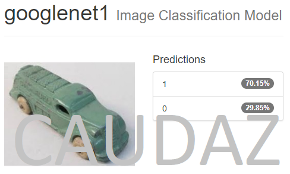

# Robotics Nanodegree #

# Term2 – Project1: Robotic Inference #

## ABSTRACT ##

This project attempts to solve the problem of classification of objects.
Such a problem could be encountered on a factory, such as a toy factory
that needs to classify objects and sort them accordingly. The project
would utilize Deep Neural Networks (DNNs) to solve the problem. Data
acquisition is done to fine tune (re-train) an existing DNN for higher
accuracy and faster inference.

## INTRO ##

This problem is usually find at factories, where classification accuracy
and speed are paramount to meet quality standards. The objective of the
project is to create a classification network that achieves at least 75%
accuracy and inference time is less than 10ms. This project involves:

-   Data acquisition

-   Choosing a DNN

-   Classification

-   Test model

-   Deployment(simulating using a Jetson TX2)

For this project I chose the example of a toy factory that has to sort
thru different types of toys on a conveyor belt. I chose 2 categories to
sort: stuffed animals and cars/trucks.

## BACKGROUND/FORMULATION ##

The network chosen was GoogleNet. This was chosen by the required speed
and accuracy parameters on the following chart showing in class:

The project stated that the accuracy had to be higher than 75%.
GoogleNet is a good compromise between Accuracy and Inference speed. I
chose to re-train GoogleNet with just 2 classes, which would make it
more accurate and faster.

All the hyperparameters were already fixed on the DIGITs system.

## DATASET ##

The following steps were taken to create the dataset:

-   I gathered the data set by saving around 400 images from the
    internet for each category

-   Images were JPEGs RGB

-   Images were labeled by using the folder name in which they were
    stored

-   The images were resized to 256x256

-   The images were augmented by flipping them left to right

-   After augmentation the dataset had around 1600 images

-   Split was 75/25 for training/validation

A random sample of 16 images for each class is shown below for class0
(stuffed animals):

A random sample of 16 images for each class is shown below for class1
(Cars/Trucks):

The folders to be used for training/validation are:
- cars_trucks_ren_256x256  +  cars_trucks_ren_256x256_flip
- stuffed_animals_ren_256x256  +  stuffed_animals_ren_256x256_flip

The summary of the dataset from DIGITS is shown below:

## TRAINING ##

Training was done on DIGITS (NVIDIA Deep Learning GPU Training System):

The accuracy of the train/valid was around 98%

The model was trained using 30 epochs and using a variable training rate
of 0.01/0.001/0.0001 .

## RESULTS ##

To test the model to be deployed, I used images that were not part of
the train/valid data. These images are inside folder testdataset. Here are 6 samples with (0 is class stuffed animal
and 1 is class car/truck):

The model was able to correctly classify all 6 images. The accuracy was
much higher for the stuffed animal class, possibly because of the easier
to identify features such as eyes, mouth, and round shapes. The accuracy
for the stuffed animal classification was very high, it was around 99.7%

## DISCUSSION ##

The results are very good for the classification, especially for the
stuffed animal class, this may be in part a result of the dataset coming
from google images, in which most stuffed animals are always pointing
straight into the image. The truck/car images are taken from all angles
and directions, so this will contribute to the classification not being
as accurate.

I was not able to redeploy since I do not have a Jetson TX2, so only the
computer simulated was done.

## CONCLUSION/FUTURE WORK ##

The DNN was able to correctly identify the items accurately and at a
very fast rate. This would certainly work on a conveyor system for a
factory to sort out the objects.

The model could be easily enhanced by adding other categories such as:
puzzles, books, action figures, Legos, building blocks, etc.
